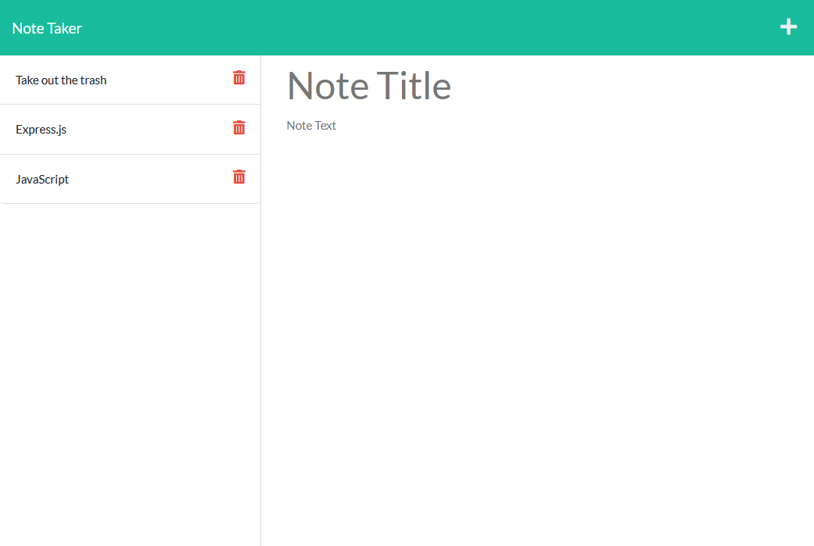

# My Note Taker

## Description

- This application is designed to take notes inputed from a user and to pin them onto the site.
- Application uses Express.js back end in order to recieve and store the data inputed in into a JSON file

## Example

## Links

- [Heroku Site link](https://my-note-taker-22.herokuapp.com/)
- [GitHub Repository Link](https://github.com/clflalo/MyNoteTaker)

## Credits

- Jesus Cifuentes

## Questions

- For any questions feel free to reach me at [Github](https://github.com/clflalo)
